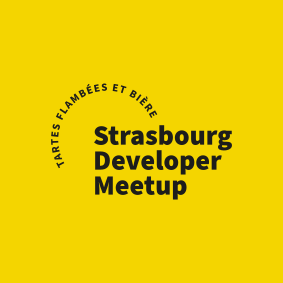

  

# Talks

Call for Paper pour les talks Strasbourg Developer Meetup.

## [🗣️ Proposer un talk](https://github.com/Strasbourg-Developer-Meetup/talks/issues/new?template=talk.md)

## [🛠️ Proposer un workshop](https://github.com/Strasbourg-Developer-Meetup/talks/issues/new?template=workshop.md)

## [💡 Soumettre une idée](https://github.com/Strasbourg-Developer-Meetup/talks/issues/new?template=idea.md)

## 🗳️ Voter pour [un talk](https://github.com/Strasbourg-Developer-Meetup/talks/issues?q=is%3Aopen+is%3Aissue+label%3A%22%F0%9F%97%A3%EF%B8%8F+talk%22+sort%3Aupdated-desc) ou [une idée](https://github.com/Strasbourg-Developer-Meetup/talks/issues?q=is%3Aopen+is%3Aissue+sort%3Aupdated-desc+label%3A%22%F0%9F%92%A1+id%C3%A9e%22) en utilisant la réaction 👍.

### Liens utiles

🗺️ [Meetup.com](https://www.meetup.com/fr-FR/strasbourg-developer-meetup/) | 📧 [Discord](https://discord.gg/qaHqeVUp5g) | 🐦 [Twitter](https://twitter.com/StrasDevMeetup) | 📜 [Code de Conduite](./CODE_OF_CONDUCT.md)

### Où nous contacter ?

Si vous avez des questions n'hésitez pas à nous contacter :

- 📧 [Discord Strasbourg Developer Meetup](https://discord.gg/qaHqeVUp5g)
- 🐦 [Twitter Strasbourg Developer Meetup](https://twitter.com/StrasDevMeetup)
- 🐦 [Twitter Thomas Stocker](https://twitter.com/0xStocki)
- 🐦 [Twitter Paul Chobert](https://twitter.com/barodeur)

### [📜 Code de Conduite](./CODE_OF_CONDUCT.md)

#### Ce dépôt a été inspiré par :

- [StrasbourgJS/talks](https://github.com/Strasbourg-Developer-Meetup/talks)
- [ParisTypeScript/talks](https://github.com/ParisTypeScript/talks)
- [GDGToulouse/meetup-cfp](https://github.com/GDGToulouse/meetup-cfp)
